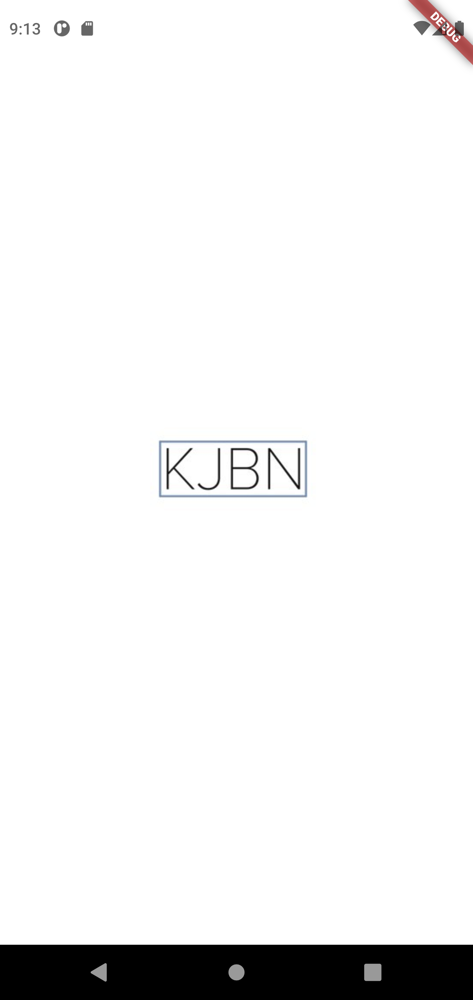
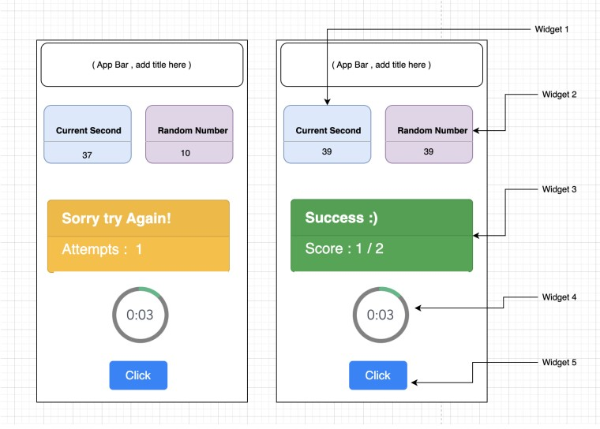
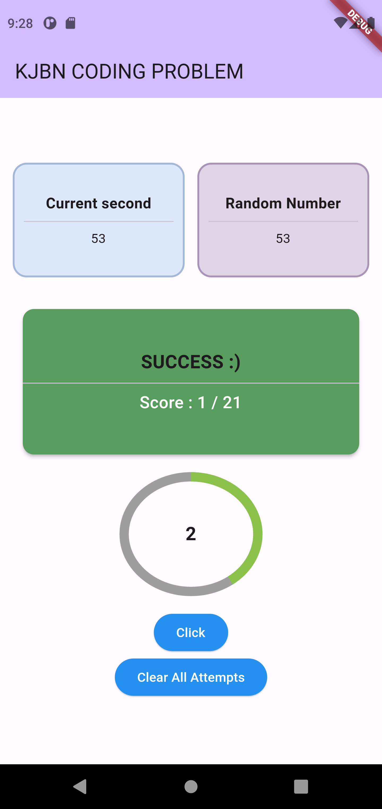
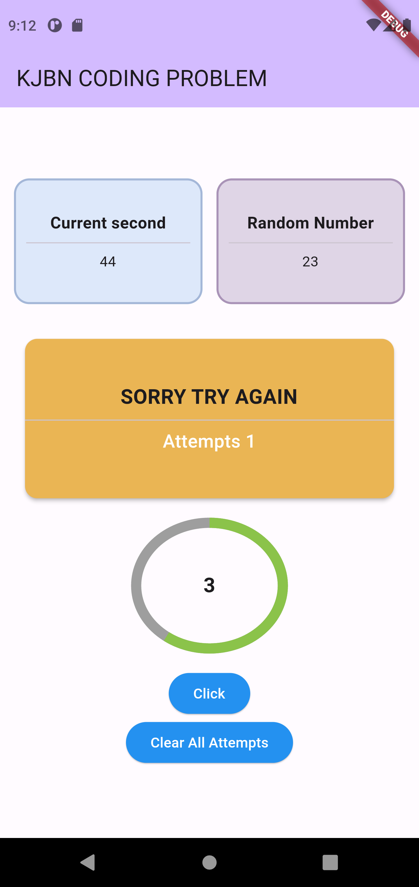
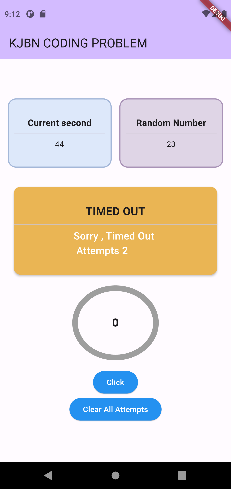

# Flutter Mobile App - Random 60 Game

## Overview

This Flutter mobile app is a simple game that challenges users to tap a button and match a randomly generated number with the seconds elapsed since the last tap. The game includes a circular timer, success/failure messages with scoring, and a splash page during app launch.

## Features

1. **Splash Page:**
   - Displayed for 1.5 seconds during app launch.
<p align="center">

</p>


2. **Game Page:**

   
<div align="center">
  
</div>


   - **Widget 1 (Seconds Display):**
     - Shows the seconds elapsed from the last tap.
   - **Widget 2 (Random Number):**
     - Displays a random number between 0 and 59.
   - **Widget 3 (Success/Failure Message):**
     - Shows success or failure messages along with the score and attempts.
   - **Widget 4 (Circular Timer):**
     - Resets automatically after 5 seconds.
   - **Widget 5 (Button):**
     - Tapping on this button triggers various actions:
       - Generates a new random number (Widget 2).
       - Updates Widget 1 with seconds from the tap time.
       - Checks if the random number matches the seconds; displays success/failure message accordingly.
       - Resets Widget 4 timer to 5 seconds.

3. **Timeout Handling:**
   - If the user fails to tap Widget 5 before Widget 4 counts down to 0, it results in a new failure attempt.
   - Widget 3 shows a message indicating a timeout penalty with the total attempts.

4. **Persistence:**
   - All game values are retained upon closing and reopening the app.
  
 <p align="center">
  


 </p>

   


## How to Run

1. Clone the repository:

    ```bash
    git clone https://github.com/NishantM-7/kjbn.git
    ```

2. Navigate to the project folder:

    ```bash
    cd kjbn
    ```

3. Open the project in your preferred Flutter development environment.

4. Run the app on an Android or iOS emulator or physical device.

5. Enjoy playing the Random Number Game!

## Dependencies

Ensure you have Flutter installed on your development machine. You can install it by following the instructions on the official [Flutter website](https://flutter.dev/docs/get-started/install).

